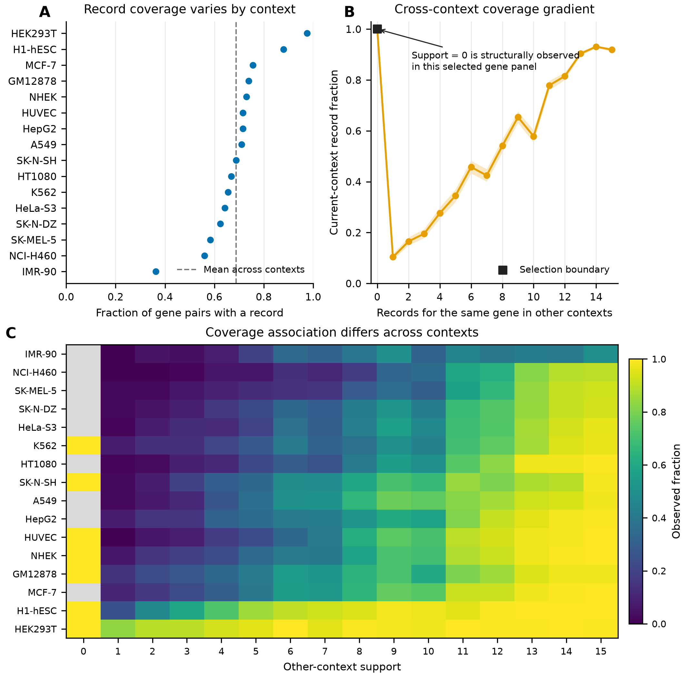
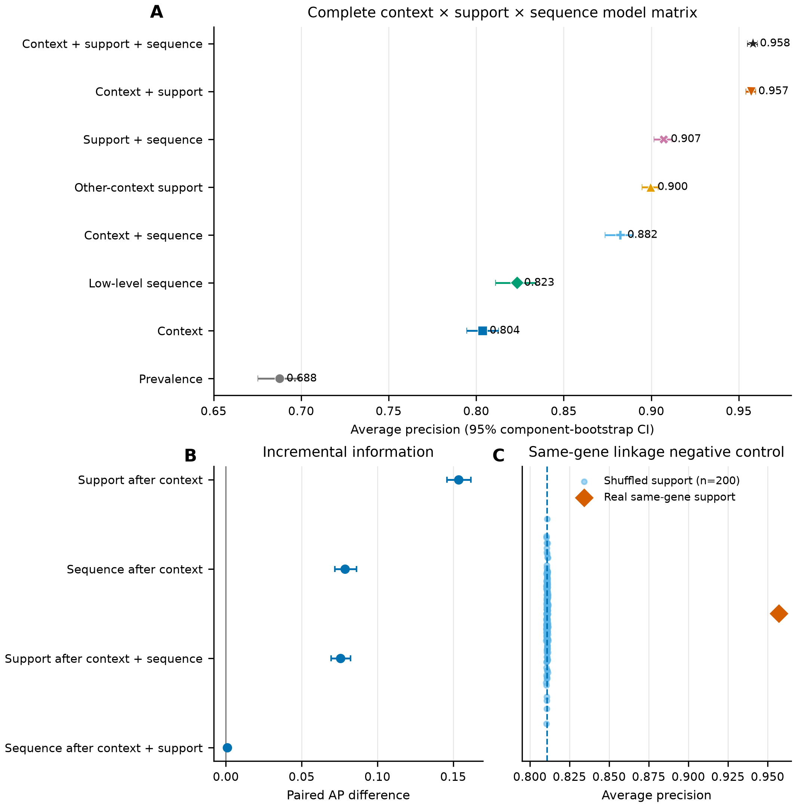
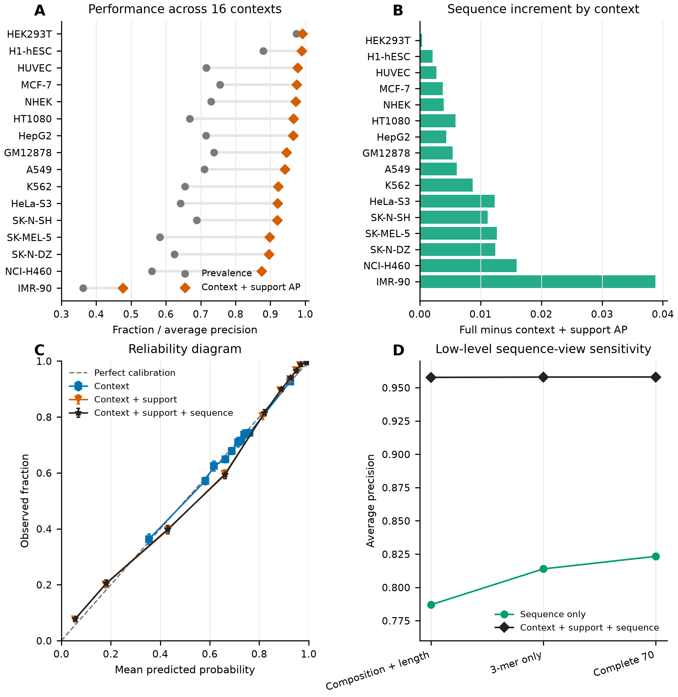
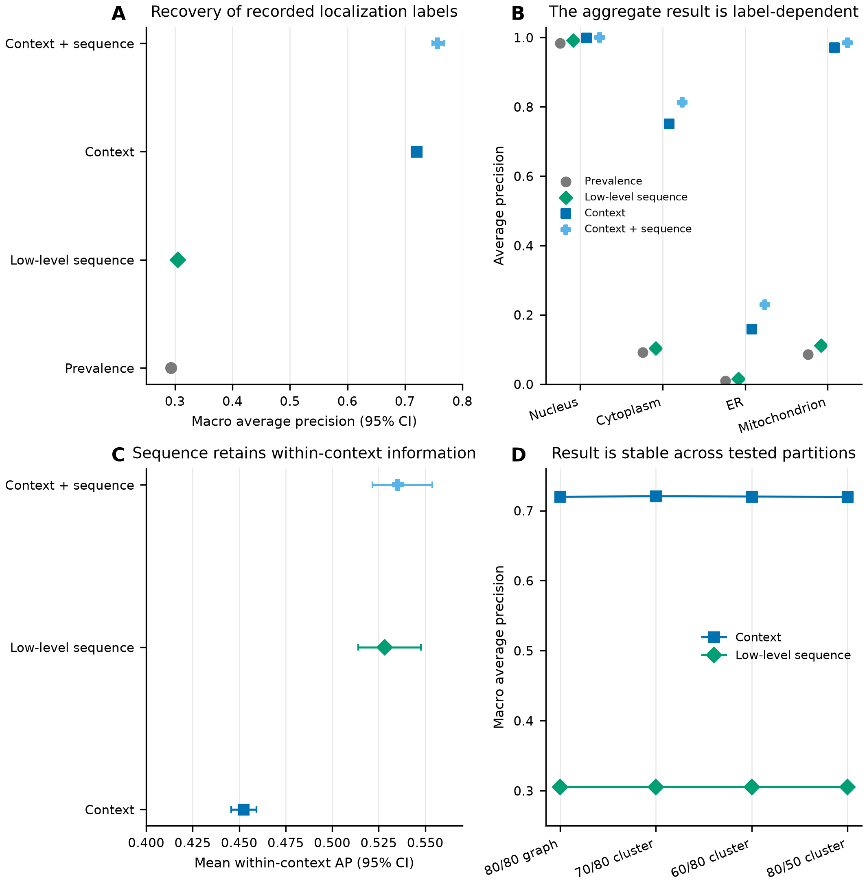

# Auditing Whether Models Learn RNA Sequence or Database Structure in RNALocate

A concise, high-school-friendly computational audit by **Yicheng "Billy" Lu** (Computer Engineering student, University of California, Santa Barbara) and **Xinyi Lu** (student, Lynbrook High School).

## The question in plain language

RNA-localization databases are often used to train machine-learning models. But a high score does not automatically mean that a model learned RNA biology. It may instead learn which genes and cellular contexts are already well represented in the database.

We asked one focused question:

> When a model predicts whether RNALocate contains a record, how much information comes from RNA sequence, and how much comes from database structure?

This project predicts **record availability**, not the true biological location of an unrecorded RNA. An absent database record is treated as unknown, not as a verified biological negative.

## Main result

We studied 18,753 genes across 16 cellular contexts, creating 300,048 gene-context pairs. Genes related by the sequence-similarity graph were kept in the same train, validation, or test partition.

| Information given to the model | Held-out average precision |
|---|---:|
| Prevalence baseline | 0.6876 |
| Context only | 0.8036 |
| Low-level sequence only | 0.8234 |
| Context + sequence | 0.8823 |
| Other-context support only | 0.8996 |
| Context + support | 0.9572 |
| Context + support + sequence | 0.9580 |

“Other-context support” means the number of other cellular contexts in which the same gene already has a retained record. After context and support were included, adding the tested sequence features increased average precision by only **0.00087**.

In 200 negative controls, support values were shuffled among genes within each context and split. Mean average precision fell to **0.8108**, showing that the large gain depended on linking each gene to its own cross-context database coverage.

## The four figures

### 1. Database coverage is uneven



### 2. Context and support explain most predictable record availability



### 3. The pattern is broad but differs by context



### 4. Database structure also affects annotation recovery



Full captions and accessible descriptions are in [figure_captions.md](figure_captions.md). Each figure is supplied as PNG, SVG, and PDF, with its plotting table in [source_data](source_data).

## Read the paper

- [Preprint PDF](paper/preprint.pdf)
- [Editable preprint DOCX](paper/preprint.docx)
- [Supporting Information](paper/supporting_information.pdf)
- [Plain-text manuscript](paper/manuscript.md)
- [Frozen analysis plan](analysis_plan.md)

## Reproduce the included figures

Python 3.11 or newer is recommended.

```bash
python -m venv .venv
# Windows: .venv\Scripts\activate
# macOS/Linux: source .venv/bin/activate
python -m pip install -r requirements.txt
python scripts/make_figures.py
python scripts/verify_release.py
```

The release includes aggregate result tables so the four figures can be rebuilt without redistributing record-level RNALocate data.

## Re-run the complete model analysis

The full analysis script is [scripts/run_analysis.py](scripts/run_analysis.py). It expects four local inputs under `inputs/` by default:

| File | Required columns or shape |
|---|---|
| `observed_gene_context_pairs.tsv.gz` | `rna_symbol`, `context` |
| `eligible_genes.tsv.gz` | `rna_symbol`; row order must match the feature matrix |
| `gene_component_split.tsv` | `rna_symbol`, `cluster_representative`, `split` |
| `sequence_features_70.npy` | one row per eligible gene and 70 columns |

These inputs are not included because the public release should not silently redistribute third-party source records or large derived matrices. Paths can be changed with `--panel`, `--reference`, `--split`, and `--features`.

Example:

```bash
python scripts/run_analysis.py --bootstrap 1000 --permutations 200
python scripts/make_figures.py
python scripts/verify_release.py
```

## Repository map

```text
figures/       Four figures in PNG, SVG, and PDF
paper/         Preprint, editable DOCX, supplement, and Markdown manuscript
results/       Aggregate model outputs used by the plotting script
scripts/       Full analysis, figure generation, and release verification
source_data/   Figure-specific tables
analysis_plan.md
figure_captions.md
```

## What the study does and does not show

The results show that RNALocate record coverage has strong, predictable structure. They do **not** show that RNA sequence is irrelevant, that an unrecorded pair is biologically negative, or that database curators caused the pattern. The sequence tests used simple composition and 3-mer features, not every possible RNA model.

## Ethics and data availability

This study used previously published, publicly accessible molecular datasets and involved no direct interaction with human participants, identifiable clinical information, or new animal experiments.

RNALocate v3.0 is available from its official database. This repository provides code, aggregate result tables, figure source tables, figures, and manuscript files. It intentionally omits record-level source data and large intermediate matrices.

## License

No reuse license has been selected yet. The repository is public for inspection and reproducibility; reuse permissions should be confirmed with the authors until a license is added.
